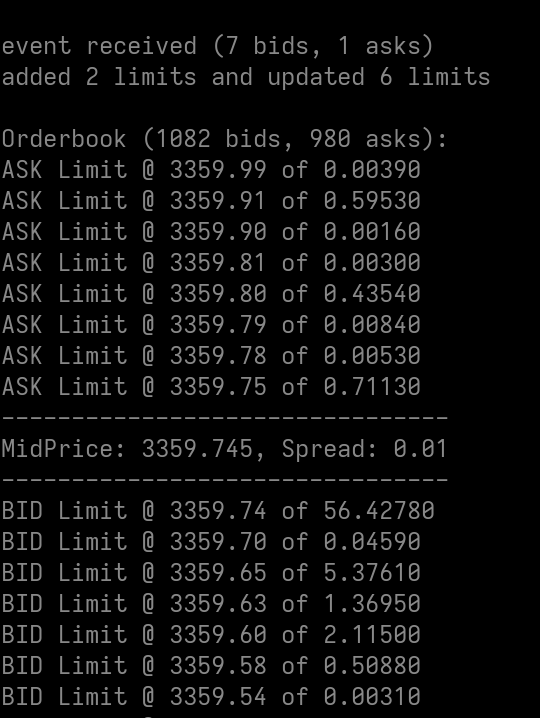

# Binance Orderbook

Simple Python project allowing one to run a Binance order book locally.



This project simply follows the Binance API recommendations that you can find [here](https://developers.binance.com/docs/binance-spot-api-docs/web-socket-streams#how-to-manage-a-local-order-book-correctly).

The goal of this project is to collect order-book data that could be used financial modelling projects.

Note that the highest frequency at which Binance allows us to update the status of our order-book is 100ms, therefore that which not suit for high-frequency trading.

Usage:
```
python3 main.py <symbol>
```

Example:
```
python3 main.py ETHUSDT
```
